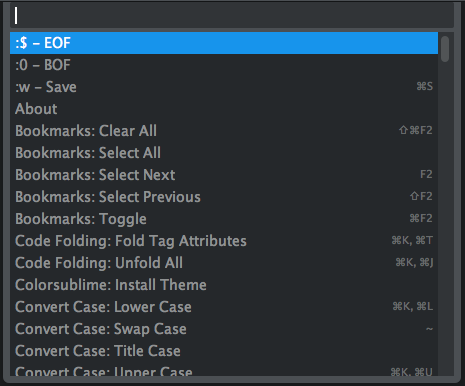
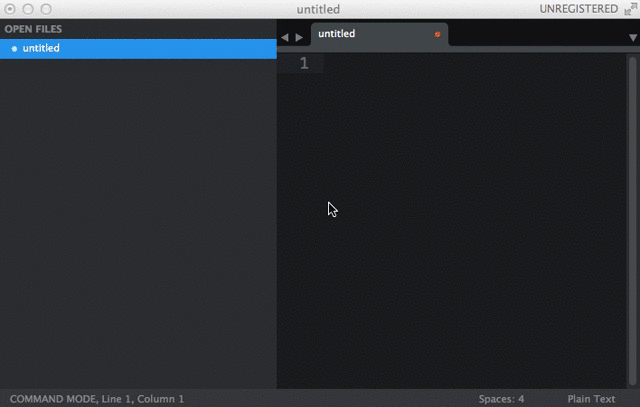
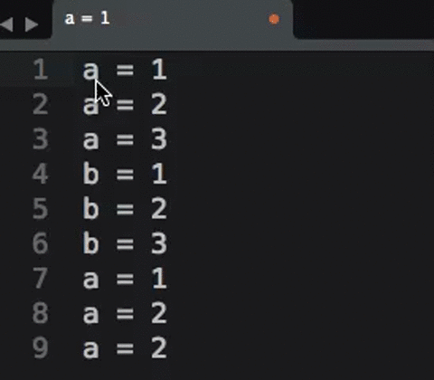
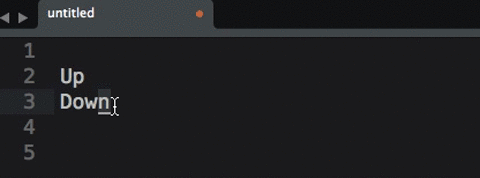
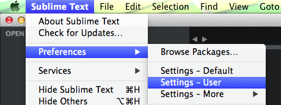
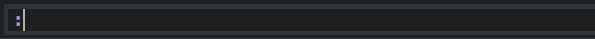
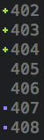

sublime-text-tips
=================

SublimeText 是近年迅速竄紅的文字編輯器之一，受到很多前端以及程式設計師的喜愛。但歷經了 SublimeText 2 以及 SublimeText 3 兩種版本的演進之後，網路上眾多對於如何設定與使用 SublimeText 的相關文件已有些雜亂無章。為此，本文件希望透過整理，將雜亂的資訊整合，以降低進入門檻，便利他人迅速學習使用 SublimeText 。

# Useful Shortcuts (Mac OS X)

事實上，學會利用 SublimeText 快捷鍵是提升編輯效率的一大良方。本章節在此條列較常被使用的幾種快捷鍵，可使人迅速體驗 SublimeText 的魅力。

## Command Palette

`Command Palette` 是 SublimeText 的重要功能之一，許多的功能都可以透過 `Command Palette` 進行呼叫，例如自動美化排版、設定 Language Syntax 等，因此在使用 SublimeText 過程中，是絕對少不了呼叫 `Command Palette` 的。

快捷鍵:

```
Command + Shift + P
```

圖示:



## Python Console

SublimeText 其實內建有 Python Console，對於有在撰寫 Python 的開發者其實可以嘗試看看。此外，著名的 SublimeText `Package Control` 套件就是透過 Python Console 進行安裝的。

快捷鍵:

```
Ctrl + `
```

圖示:



## 多重選取

多重選取是 SublimeText 其中一個相當實用的功能，對於需要經常修正程式變數名稱的人而言，是一個相當俱有吸引力的功能。

多重選取 & 編輯示意圖:



快捷鍵 1

1. 選取文字之後
2. **重複** 按 `Commando + D` 可以一次將所有相同文字選取起來
3. 依照需求進行編輯

快捷鍵 2

1. 選取文字之後
2. 按 `Ctrl + Commando + G` 可以一次將相同文字選起來
3. 依照需求進行編輯

## 行操作

### 合併多行成一行

示意圖:

快捷鍵:

1. 選取要合併的文字
2. 按 `Command + J`

### 上下行互換

示意圖:



快捷鍵:

```
Command + Ctrl + 上/下方向鍵
```

### 單行註解

快捷鍵:

```
Command + /
```

### 多行註解

快捷鍵 1:

1. 選取要註解的文字
2. 按 `Command + Shift + /`

快捷鍵 2:

1. 選取要註解的文字
2. 按 `Command + Shift + P` 呼叫 `Command Palette`
3. 輸入 `toggle comment` 或 `toggle block comment`

    > Toggle comment -> 單行註解
    >
    > Toggle block comment -> 多行註解

## 文字編輯

### 大小寫轉換

快捷鍵 1:

1. 選取文字
2. 按 `Command + K` 放開後，迅速按 `u` 或 `U`

快捷鍵 2:

1. 選取文字
2. 按 `Command + Shift + P` 呼叫 `Command Palette`
3. 可輸入 `title`, `lower case`, `upper case`

    >Title -> 首字大寫
    >
    >Lower Case -> 全部小寫
    >
    >Upper Case -> 全部大寫


## 搜尋/取代

### 全專案搜尋 ＆ 取代

快捷鍵:

```
Command + Shitf + F
```

## 游標操作

### 跳至特定行

快捷鍵 1:

1. 按 `Command + P`
2. 輸入 `:行號`

快捷鍵 2:

1. 按 `Ctrl + G`
2. 輸入行號

### 跳到對應的 大/中/小括號

```
Ctrl + M
```

## 捲軸操作

### 移動捲軸

快捷鍵:

```
Ctrl + Alt + 上/下 方向鍵
```

## 分頁操作

### 分頁間切換

```
Command + Alt + 左/右 方向鍵
```

## 切割視窗

SublimeText 也有相當簡便的視窗切割功能，對於多視窗編輯相當有幫助。

### 水平切割視窗

快捷鍵:

```
Command + Alt + Shift + 2/3
```

> 2 代表切 2 格
>
> 3 代表切 3 格

### 垂直切割視窗

```
Command + Alt + 1/2/3/4
```

### 回復單個視窗

快捷鍵:

```
Command + Alt + 1
```

## 其他

### 結束當前的 HTML 標籤

例如輸入完 `<div>Hello, SublimeText` 之後，自動補完 `</div>`。對 Web 前端開發者相當方便的功能。

快捷鍵:

```
Command + Alt + .
```

更多關於 [SublimeText 快捷鍵](http://sublime-text-unofficial-documentation.readthedocs.org/en/latest/reference/keyboard_shortcuts_osx.html)


# SublimeText 基本設定 (Mac OS X)

SublimeText 也提供了設定檔的功能，讓使用者能夠針對自己的習慣客制化 SublimeText。例如，佈景主題的更換、Tab寬度設定、尺規的顯示等等，這些都能夠在設定檔中進行設定。

SublimeText 所有設定檔都是 JSON 格式，因此要注意設定時是否有違反 JSON 格式的地方。

而 SublimeText 設定檔一般可分為`使用者設定檔`、 `套件設定檔`、`程式語言設定檔`幾種，接下來的部分會針對`使用者設定檔`與`程式語言設定檔`進行解說。

## 打開使用者設定檔

```
Preferences > Settings — User
```

操作圖示：



快捷鍵:

```
Command + ,
```

## 使用者設定檔範例

事實上，並沒有硬性規定`使用者設定檔`必須放置什麼內容，一切依使用者習慣為主。有些使用者喜歡將設定檔一併放置於`使用者設定檔`中，有些使用者則喜歡依照程式語言進行不同的設定。

以下是編者的範例設定檔，各位可依照自己的需求進行修正。詳細的設定選項解說，可參閱[這裡](http://sublime-text-unofficial-documentation.readthedocs.org/en/latest/reference/settings.html)。

```
{
	"always_show_minimap_viewport": true,
	"draw_minimap_border": true,
	"caret_style": "solid",
	"wide_caret": true,
	"file_exclude_patterns":
    [
        ".DS_Store",
        "*.pid",
        "*.pyc"
    ],
	"folder_exclude_patterns":
	[
		".svn",
		".git",
		".hg",
		"CVS",
		"__pycache__"
	],
	"font_size": 18,
	"ignored_packages":
	[
	    "vintage"
	],
	"rulers":
 	[
		72,
		79
	],
	"tab_size": 4,
	"translate_tabs_to_spaces": true,
	"trim_trailing_white_space_on_save": true,
	"ensure_newline_at_eof_on_save": true,
}
```

## 程式語言設定檔

由於不同的程式語言會有不同的 Coding Style ，因此 SublimeText 中也可以針對不同的程式語言進行設定。

設定方式:

1. 開啓新的設定檔

    

    ```
    Sublime Text > Preferences > Settings – More > Syntax Specific – User
    ```

2. 輸入設定

3. 將檔案名稱存成 `LANGUAGE.sublime-settings`
    > 例如 Python 就要存成 `Python.sublime-settings`

`Python.sublime-settings`範例:

```
{
    "draw_white_space": "all",
    "auto_indent": true,
    "rulers": [79],
    "smart_indent": true,
    "trim_automatic_white_space": true,
    "trim_trailing_white_space_on_save": true,
    "ensure_newline_at_eof_on_save": true,
    "tab_size": 4,
    "translate_tabs_to_spaces": true,
    "use_tab_stops": true,
    "word_wrap": true,
    "wrap_width": 80,
    "file_exclude_patterns":
    [
        "*.pyc"
    ],
}
```

## 更換字體的設定

字體的更換也可以透過設定檔達成，以下是字體的設定檔範例：

```
    "font_face": "Ubuntu Mono",
    "font_size": 16.0,
    "font_options": ["subpixel_antialias", "no_bold"],
    "line_padding_bottom": 0,
    "line_padding_top": 0,
```

受推薦程式開發用的[字體下載](http://www.slant.co/topics/67/~what-are-the-best-programming-fonts)

# SublimeText 套件

SublimeText 的擴充套件庫也是為人津津樂道的功能之一，許多開發上的特殊需求，透過擴充套件就可以輕鬆被滿足。因此，學會如何運用 SublimeText 的套件也是相當重要的一件事。

## 必裝 Packages

在所有套件中，最為重要的就是 `Package Control` ，因此本教學將之列為必裝。因為實在是沒有它會相當不方便。

因為目前是透過執行Python程式碼進行安裝，所以安裝的過程會有一些安全性的顧慮，本文就不贅述，安裝的步驟請參與以下官方連結：

[Package Control](https://sublime.wbond.net/installation#st3)

請注意官方網站上的警告，千萬不要在非官方網站上複製安裝 `Package Control` 的程式碼：

```
WARNING: Please do not redistribute the install code via another website. It will change with every release. Instead, please link to this page.
```

使用方法:

1. 安裝完後，只要按 `Command + Shift + P` 呼叫 `Command Palette` 後，輸入 `install package` 就會出現以下畫面:

    

2. 按 `Enter` 後稍等一陣子會跳出另一個輸入框，只要輸入想安裝的套件名稱後，再按 `Enter` 即可安裝。

## 推薦的 Packages

### 佈景主題類

- `Flatland`

    扁平式 UI 風格的佈景主題。

    設定範例(建議放在`使用者設定檔`內)：

    ```
    {
      "theme": "Flatland Dark.sublime-theme",
      "color_scheme": "Packages/Theme - Flatland/Flatland Dark.tmTheme"
    }
    ```

    > `theme` 修改的是視窗主題
    >
    > `color_scheme` 修改的是文字配色主題

- `Color Scheme - Tomorrow Night`

    黑暗系的 Color Theme

### VIM 愛用者

- Vintageous

    安裝完後會按 `Shift + :` 就可以呼叫 `VIM Console` 。

    示意圖：

    

### 功能強化類

- SideBarEnhancements

    強化 SideBar 的功能

- SublimeCodeIntel

    強化自動補完功能，讓自動補完功能可以支援跨檔案搜尋

- GitGutter

    會在編輯器的行數顯示旁邊，依照 Git 編輯的狀態，顯示不同的圖標，例如新增刪除修改

    示意圖:

    

- SublimeLinter

    提供一個linter的框架，讓你可以安裝不同的Linter

    詳見[SublimeLinter](https://github.com/SublimeLinter/SublimeLinter3)

- HTML-CSS-JS Prettify

    安裝後，在 `Command Palette` 輸入指令 `HTMLPrettify` 就可以自動針對HTML排版

## 其他佈景主題(Color Themes/Themes)

- colorsublime

    http://colorsublime.com/how-to-install-a-theme

- sublimetext-defaultplus-theme

    https://github.com/mediachicken/sublimetext-defaultplus-theme


# 其他

## 將 SublimeText 設定為終端機指令之一

Mac OS X:

```
ln -s /Applications/Sublime\ Text\ 2.app/Contents/SharedSupport/bin/subl /usr/local/bin/subl
```

輸入上述指令之後，就可以用 `subl` 打開檔案:

```
subl helloworld.py
```

## 將 SublimeText 作為預設文字編輯器

ps: 要先將 SublimeText 設定為終端機指令之一

```
alias nano="subl"
export EDITOR="subl"
```


## 將 SublimeText 作为 Git 預設編輯器使用

ps: 要先將 SublimeText 設定為終端機指令之一

```
export GIT_EDITOR="subl --wait --new-window"
```

# 參考資料

[Sublime Text 3 Documentation](http://www.sublimetext.com/docs/3/)
[Sublime Text Unofficial Documentation](https://sublime-text-unofficial-documentation.readthedocs.org/en/latest/)
[Setting Up Sublime Text 3 for Full Stack Python Development](https://realpython.com/blog/python/setting-up-sublime-text-3-for-full-stack-python-development/)
[Sublime Text 3 新手上路：必要的安裝、設定與基本使用教學](http://blog.miniasp.com/post/2014/01/07/Useful-tool-Sublime-Text-3-Quick-Start.aspx)
